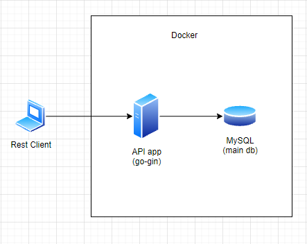

# Introduction
go-account is my self-learning project to study how to achieve rest api using go gin framework

# Introduction

This repository contains about a deposit and loan management application in a village that nowhere. hehe.

# Tech Stack

I used these tech stack for create this project with:
* Go
* [Gin Framework](https://github.com/gin-gonic/gin)
* MySQL
* Swagger 2

# Architecture

# Api Documentation

This project already have an API Documentation that we create using Swagger 2. 

You can read that documentation on : http://localhost:8090/swagger-ui/

You also can test our API using Postman. You can download the postman file [here](https://github.com/rizkyjayusman/go-account/blob/main/docs/go-account.postman_collection.json)

# Implemented Features

This tables shows which features that has been implemented by this repository.

:white_check_mark: : ready

:heavy_exclamation_mark: : in progress

:x: : not yet implemented

| Features                        | Status                              |
| ------------------------------- | ----------------------------------- |
| Check Balance Account           | :x:                                 |
| Transfer Balance                | :x:                                 |
| Unit Test                       | :x:                                 |
| Api Documentation with Swagger  | :x:                                 |

# Build and Run (Without Docker)

coming soon!

# Build and Run (With Docker)

coming soon!
